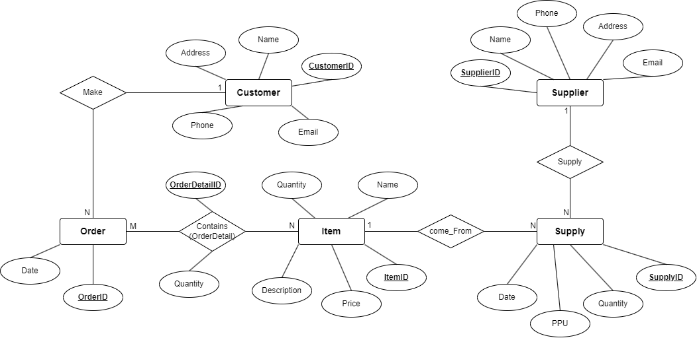
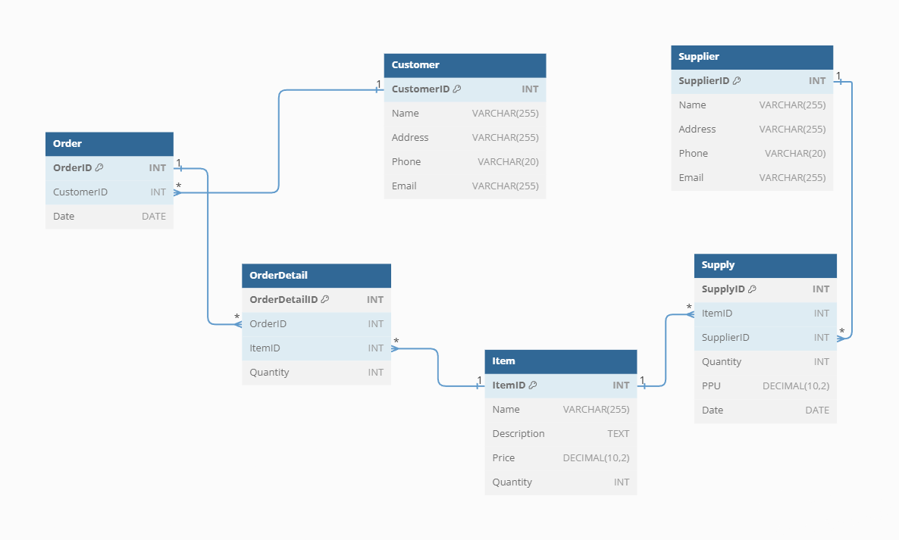

# inventory-management-system

## 📝 Table of Contents
- [📝 Table of Contents](#-table-of-contents)
- [ℹ Description](#ℹ-description)
- [🧰 Resources](#-resources)
- [✏ ERD's and Diagrams](#-erds-and-diagrams)
- [📋 API Endpoints and Documentation](#-api-endpoints-and-documentation)
  - [/items](#items)
  - [/suppliers](#suppliers)
  - [/customers](#customers)
  - [/orders](#orders)
  - [/supplies](#supplies)

## ℹ Description
This is a simple inventory management system REST API, it allow managing Items, Customers, Orders, Suppliers, and supplies, it is still under development.

## 🧰 Resources
the following are the resources in the inventory management system API
- ***Items*** : the products in the inventory

- ***Suppliers*** : the people who supply the items to the inventory

- ***Customers*** : are the people who buy the items

- ***Orders*** : the transactions of the items between the customers and the inventory

- ***Supplies*** : the transaction of the items between the suppliers and the inventory

## ✏ ERD's and Diagrams
- The following diagram shows the Entity Relationship Diagram.
    

- The following diagram shows the database Design.
    

## 📋 API Endpoints and Documentation
- The following are the API endpoints and their documentation

`Base URL : example.com/api/v1`

### Resoucrce : /items

| HTTP Request | Operation | Description | HTTP Status Code | Request Body Sample | Response Body Sample |
| ------------ | --------- | ----------- | ---------------- | -------------- | --------------- |
| GET /items    | Read | Get all items | 200 (OK)   401 (Unauthorized)   403 (Forbidden)   429(Too Many Requests)   500(Internal Server Error) | N/A |  <pre lang="json">{&#13; "items": [&#13; {&#13; "id": 1, &#13; "name": "item1", &#13; "description": "item1 description", &#13; "price": 100, &#13; "quantity": 10 &#13; }, &#13; {&#13; "id": 2, &#13; "name": "item2", &#13; "description": "item2 description", &#13; "price": 200, &#13; "quantity": 20 &#13; } &#13; ] &#13; }</pre>   |
| GET /items/{id} | Read | Get item by id | 200 (OK)   401 (Unauthorized)  403 (Forbidden)  404 (Not Found)  429(Too Many Requests)  500(Internal Server Error) | N/A |  <pre lang="json">{&#13; "item": {&#13; "id": 1, &#13; "name": "item1", &#13; "description": "item1 description", &#13; "price": 100, &#13; "quantity": 10 &#13; } &#13; }</pre>   |
| POST /items | Create | Create new item the quantity initiale zero | 201 (Created)   401 (Unauthorized)   403 (Forbidden)   429(Too Many Requests)   415 (Unsupported Media Type)   500(Internal Server Error) |  <pre lang="json">{&#13; "name": "item1", &#13; "description": "item1 description", &#13; "price": 100, &#13; }</pre>   |  <pre lang="json">{&#13; "item": {&#13; "id": 1, &#13; "name": "item1", &#13; "description": "item1 description", &#13; "price": 100, &#13; "quantity": 10 &#13; } &#13; }</pre>   |
| PUT /items/{id} | Update | Update item by id | 200 (OK)   401 (Unauthorized)   403 (Forbidden)   404 (Not Found)   429(Too Many Requests)   415 (Unsupported Media Type)   500(Internal Server Error) |  <pre lang="json">{&#13; "name": "item1", &#13; "description": "item1 description", &#13; "price": 100, &#13; }</pre>   |  <pre lang="json">{&#13; "item": {&#13; "id": 1, &#13; "name": "item1", &#13; "description": "item1 description", &#13; "price": 100, &#13; "quantity": 10 &#13; } &#13; }</pre>   |
| DELETE /items/{id} | Delete | Delete item by id | 204 (No Content)   401 (Unauthorized)   403 (Forbidden)   404 (Not Found)   429(Too Many Requests)   500(Internal Server Error) | N/A | N/A |
| PATCH /items/{id} | Partial Update | Partial Update item by id | 200 (OK)   401 (Unauthorized)   403 (Forbidden)   404 (Not Found)   429(Too Many Requests)   415 (Unsupported Media Type)   500(Internal Server Error) |  <pre lang="json">{&#13; "name": "item1" &#13; }</pre>   |  <pre lang="json">{&#13; "item": {&#13; "id": 1, &#13; "name": "item1", &#13; "description": "item1 description", &#13; "price": 100, &#13; "quantity": 10 &#13; } &#13; }</pre>   |

### Resoucrce : /suppliers

| HTTP Request | Operation | Description | HTTP Status Code | Request Body Sample | Response Body Sample |
| ------------ | --------- | ----------- | ---------------- | -------------- | --------------- |
| GET /suppliers    | Read | Get all suppliers | 200 (OK)   401 (Unauthorized)   403 (Forbidden)   429(Too Many Requests)   500(Internal Server Error) | N/A |  <pre lang="json">{&#13; "suppliers": [&#13; {&#13; "id": 1, &#13; "name": "supplier1", &#13; "email": "supp@gmail.com", &#13; "phone": "123456789" &#13; }, &#13; {&#13; "id": 2, &#13; "name": "supplier2", &#13; "email": "supp2@gmil.com", &#13; "phone": "123456789" &#13; } &#13; ] &#13; }</pre>   |
| GET /suppliers/{id} | Read | Get supplier by id | 200 (OK)   401 (Unauthorized)  403 (Forbidden)  404 (Not Found)  429(Too Many Requests)  500(Internal Server Error) | N/A |  <pre lang="json">{&#13; "supplier": {&#13; "id": 1, &#13; "name": "supplier1", &#13; "email":"supp@gmail.com",&#13; "phone": "123456789" &#13; } &#13; }</pre>   |
|GET /suppliers/{id}/supply | Read | Get all supplies of a supplier | 200 (OK)   401 (Unauthorized)   403 (Forbidden)   429(Too Many Requests)   500(Internal Server Error) | N/A |  <pre lang="json">{&#13; "supplies": [&#13; {&#13; "id": 1, &#13; "item_id": 1, &#13; "supplier_id": 1, &#13; "quantity": 10, &#13; "price_per_unit": 100, &#13; "date": "2021-10-10" &#13; }, &#13; {&#13; "id": 2, &#13; "item_id": 2, &#13; "supplier_id": 1, &#13; "quantity": 20, &#13; "price_per_unit": 200, &#13; "date": "2021-10-10" &#13; } &#13; ] &#13; }</pre>   |
| GET /suppliers/{id}/item | Read | Get the item of a supplier | 200 (OK)   401 (Unauthorized)   403 (Forbidden)   429(Too Many Requests)   500(Internal Server Error) | N/A |  <pre lang="json">{&#13; "item": {&#13; "id": 1, &#13; "name": "item1", &#13; "description": "item1 description", &#13; "price": 100, &#13; "quantity": 10 &#13; } &#13; }</pre>   |
| POST /suppliers | Create | Create new supplier | 201 (Created)   401 (Unauthorized)   403 (Forbidden)   429(Too Many Requests)   415 (Unsupported Media Type)   500(Internal Server Error) |  <pre lang="json">{&#13; "name": "supplier1", &#13; "email": "supp@gmail.com", &#13; "phone": "123456789" &#13; }</pre>   |  <pre lang="json">{&#13; "supplier": {&#13; "id": 1, &#13; "name": "supplier1", &#13; "email": "supp@gmail.com", &#13; "phone": "123456789" &#13; } &#13; }</pre>   |
| POST /suppliers/{id}/supply | Create | Create new supply for a supplier | 201 (Created)   401 (Unauthorized)   403 (Forbidden)   429 (Too Many Requests)   415 (Unsupported Media Type)   500 (Internal Server Error) |  <pre lang="json">{&#13; "item_id": 1, &#13; "supplier_id": 1, &#13; "quantity": 10, &#13; "price_per_unit": 100, &#13; "date": "2021-10-10" &#13; }</pre>   |  <pre lang="json">{&#13; "supply": {&#13; "id": 1, &#13; "item_id": 1, &#13; "supplier_id": 1, &#13; "quantity": 10, &#13; "price_per_unit": 100, &#13; "date": "2021-10-10" &#13; } &#13; }</pre>   |
| PUT /suppliers/{id} | Update | Update supplier by id | 200 (OK)   401 (Unauthorized)   403 (Forbidden)   404 (Not Found)   429(Too Many Requests)   415 (Unsupported Media Type)   500(Internal Server Error) |  <pre lang="json">{&#13; "name": "supplier1", &#13; "email": "supp@gmail.com", &#13; "phone": "123456789" &#13; }</pre>   |  <pre lang="json">{&#13; "supplier": {&#13; "id": 1, &#13; "name": "supplier1", &#13; "email": "supp@gmail.com", &#13; "phone": "123456789" &#13; } &#13; }</pre>   |
| DELETE /supplier/{id} | Delete | Delete supplier by id | 204 (No Content)   401 (Unauthorized)   403 (Forbidden)   404 (Not Found)   429(Too Many Requests)   500(Internal Server Error) | N/A | N/A |
| PATCH /suppliers/{id} | Partial Update | Partial Update supplier by id | 200 (OK)   401 (Unauthorized)   403 (Forbidden)   404 (Not Found)   429(Too Many Requests)   415 (Unsupported Media Type)   500(Internal Server Error) |  <pre lang="json">{&#13; "name": "supplier1" &#13; }</pre>   |  <pre lang="json">{&#13; "supplier": {&#13; "id": 1, &#13; "name": "supplier1", &#13; "email": "supp@gmail.com", &#13; "phone": "123456789" &#13; } &#13; }</pre>   |

### Resoucrce : /customers

| HTTP Request | Operation | Description | HTTP Status Code | Request Body Sample | Response Body Sample |
| ------------ | --------- | ----------- | ---------------- | -------------- | --------------- |
| GET /customers    | Read | Get all customers | 200 (OK)   401 (Unauthorized)   403 (Forbidden)   429(Too Many Requests)   500(Internal Server Error) | N/A |  <pre lang="json">{&#13; "customers": [&#13; {&#13; "id": 1, &#13; "name": "customer1", &#13; "email": "customer@gmail.com", &#13; "phone": "123456789" &#13; }, &#13; {&#13; "id": 2, &#13; "name": "customer2", &#13; "email": "customer@gmail.com", &#13; "phone": "123456789" &#13; } &#13; ] &#13; }</pre>   |
| GET /customers/{id} | Read | Get customer by id | 200 (OK)   401 (Unauthorized)  403 (Forbidden)  404 (Not Found)  429(Too Many Requests)  500(Internal Server Error) | N/A |  <pre lang="json">{&#13; "customer": {&#13; "id": 1, &#13; "name": "customer1", &#13; "email": "customer@gmail.com", &#13; "phone": "123456789" &#13; } &#13; }</pre>   |
|GET /customers/{id}/order | Read | Get all orders of a customer | 200 (OK)   401 (Unauthorized)   403 (Forbidden)   429(Too Many Requests)   500(Internal Server Error) | N/A |  <pre lang="json">{&#13; "orders": [&#13; {&#13; "id": 1, &#13; "item_id": 1, &#13; "customer_id": 1, &#13; "quantity": 10, &#13; "date": "2021-10-10" &#13; }, &#13; {&#13; "id": 2, &#13; "item_id": 2, &#13; "customer_id": 1, &#13; "quantity": 20, &#13; "date": "2021-10-10" &#13; } &#13; ] &#13; }</pre>   |
| POST /customers | Create | Create new customer | 201 (Created)   401 (Unauthorized)   403 (Forbidden)   429(Too Many Requests)   415 (Unsupported Media Type)   500 (Internal Server Error) |  <pre lang="json">{&#13; "name": "customer1", &#13; "email": "customer@gmail.com", &#13; "phone": "123456789" &#13; }</pre>   |  <pre lang="json">{&#13; "customer": {&#13; "id": 1, &#13; "name": "customer1", &#13; "email": "customer@gmail.com", &#13; "phone": "123456789" &#13; } &#13; }</pre>   |
| POST /customers/{id}/order | Create | Create new order for a customer | 201 (Created)   401 (Unauthorized)   403 (Forbidden)   429(Too Many Requests)   415 (Unsupported Media Type)   500 (Internal Server Error) |  <pre lang="json">{&#13; "item_id": 1, &#13; "customer_id": 1, &#13; "quantity": 10 &#13; }</pre>   |  <pre lang="json">{&#13; "order": {&#13; "id": 1, &#13; "item_id": 1, &#13; "customer_id": 1, &#13; "quantity": 10, &#13; "date": "2021-10-10" &#13; } &#13; }</pre>   |
| PUT /customers/{id} | Update | Update customer by id | 200 (OK)   401 (Unauthorized)   403 (Forbidden)   404 (Not Found)   429(Too Many Requests)   415 (Unsupported Media Type)   500(Internal Server Error) |  <pre lang="json">{&#13; "name": "customer1", &#13; "email": "customer@gmail.com", &#13; "phone": "123456789" &#13; }</pre>   |  <pre lang="json">{&#13; "customer": {&#13; "id": 1, &#13; "name": "customer1", &#13; "email": "Customer@gmail.com", &#13; "phone": "123456789" &#13; } &#13; }</pre>   |
| DELETE /customers/{id} | Delete | Delete customer by id | 204 (No Content), 401 (Unauthorized), 403 (Forbidden), 404 (Not Found), 429(Too Many Requests), 500(Internal Server Error) | N/A | N/A |
| PATCH /customers/{id} | Partial Update | Partial Update customer by id | 200 (OK)   401 (Unauthorized)   403 (Forbidden)   404 (Not Found)   429(Too Many Requests)   415 (Unsupported Media Type)   500(Internal Server Error) |  <pre lang="json">{&#13; "name": "customer1" &#13; }</pre>   |  <pre lang="json">{&#13; "customer": {&#13; "id": 1, &#13; "name": "customer1", &#13; "email": "customer@gmail.com", &#13; "phone": "123456789" &#13; } &#13; }</pre>   |

### Resoucrce : /orders

| HTTP Request | Operation | Description | HTTP Status Code | Request Body Sample | Response Body Sample |
| ------------ | --------- | ----------- | ---------------- | -------------- | --------------- |
| GET /orders    | Read | Get all orders | 200 (OK)   401 (Unauthorized)   403 (Forbidden)   429(Too Many Requests)   500(Internal Server Error) | N/A |  <pre lang="json">{&#13; "orders": [&#13; {&#13; "id": 1, &#13; "item_id": 1, &#13; "customer_id": 1, &#13; "quantity": 10, &#13; "date": "2021-10-10" &#13; }, &#13; {&#13; "id": 2, &#13; "item_id": 2, &#13; "customer_id": 1, &#13; "quantity": 20, &#13; "date": "2021-10-10" &#13; } &#13; ] &#13; }</pre>   |
| GET /orders/{id} | Read | Get order by id | 200 (OK)   401 (Unauthorized)  403 (Forbidden)  404 (Not Found)  429(Too Many Requests)  500(Internal Server Error) | N/A |  <pre lang="json">{&#13; "order": {&#13; "id": 1, &#13; "item_id": 1, &#13; "customer_id": 1, &#13; "quantity": 10, &#13; "date": "2021-10-10" &#13; } &#13; }</pre>   |
| GET /orders/{id}/item | Read | Get the item of an order | 200 (OK)   401 (Unauthorized)   403 (Forbidden)   429(Too Many Requests)   500(Internal Server Error) | N/A |  <pre lang="json">{&#13; "item": {&#13; "id": 1, &#13; "name": "item1", &#13; "description": "item1 description", &#13; "price": 100, &#13; "quantity": 10 &#13; } &#13; }</pre>   |
| POST /orders | Create | Create new order | 201 (Created)   401 (Unauthorized)   403 (Forbidden)   429(Too Many Requests)   415 (Unsupported Media Type)   500 (Internal Server Error) |  <pre lang="json">{&#13; "item_id": 1, &#13; "customer_id": 1, &#13; "quantity": 10 &#13; }</pre>   |  <pre lang="json">{&#13; "order": {&#13; "id": 1, &#13; "item_id": 1, &#13; "customer_id": 1, &#13; "quantity": 10, &#13; "date": "2021-10-10" &#13; } &#13; }</pre>   |
| PUT /orders/{id} | Update | Update order by id | 200 (OK)   401 (Unauthorized)   403 (Forbidden)   404 (Not Found)   429(Too Many Requests)   415 (Unsupported Media Type)   500(Internal Server Error) |  <pre lang="json">{&#13; "item_id": 1, &#13; "customer_id": 1, &#13; "quantity": 10 &#13; }</pre>   |  <pre lang="json">{&#13; "order": {&#13; "id": 1, &#13; "item_id": 1, &#13; "customer_id": 1, &#13; "quantity": 10, &#13; "date": "2021-10-10" &#13; } &#13; }</pre>   |
| DELETE /orders/{id} | Delete | Delete order by id | 204 (No Content)   401 (Unauthorized)   403 (Forbidden)   404 (Not Found)   429(Too Many Requests)   500(Internal Server Error) | N/A | N/A |
| PATCH /orders/{id} | Partial Update | Partial Update order by id | 200 (OK)   401 (Unauthorized)   403 (Forbidden)   404 (Not Found)   429(Too Many Requests)   415 (Unsupported Media Type)   500(Internal Server Error) |  <pre lang="json">{&#13; "quantity": 10 &#13; }</pre>   |  <pre lang="json">{&#13; "order": {&#13; "id": 1, &#13; "item_id": 1, &#13; "customer_id": 1, &#13; "quantity": 10, &#13; "date": "2021-10-10" &#13; } &#13; }</pre>   |

### Resoucrce : /supplies
|                                          Resource: /supplies                                     |
| HTTP Request | Operation | Description | HTTP Status Code | Request Body Sample | Response Body Sample |
| ------------ | --------- | ----------- | ---------------- | -------------- | --------------- |
| GET /supplies    | Read | Get all supplies | 200 (OK)   401 (Unauthorized)   403 (Forbidden)   429(Too Many Requests)   500(Internal Server Error) | N/A |  <pre lang="json">{&#13; "supplies": [&#13; {&#13; "id": 1, &#13; "item_id": 1, &#13; "supplier_id": 1, &#13; "quantity": 10, &#13; "price_per_unit": 100, &#13; "date": "2021-10-10" &#13; }, &#13; {&#13; "id": 2, &#13; "item_id": 2, &#13; "supplier_id": 1, &#13; "quantity": 20, &#13; "price_per_unit": 200, &#13; "date": "2021-10-10" &#13; } &#13; ] &#13; }</pre>   |
| GET /supplies/{id} | Read | Get supply by id | 200 (OK)   401 (Unauthorized)  403 (Forbidden)  404 (Not Found)  429(Too Many Requests)  500(Internal Server Error) | N/A |  <pre lang="json">{&#13; "supply": {&#13; "id": 1, &#13; "item_id": 1, &#13; "supplier_id": 1, &#13; "quantity": 10, &#13; "price_per_unit": 100, &#13; "date": "2021-10-10" &#13; } &#13; }</pre>   |
| POST /supplies | Create | Create new supply | 201 (Created)   401 (Unauthorized)   403 (Forbidden)   429(Too Many Requests)   415 (Unsupported Media Type)   500(Internal Server Error) |  <pre lang="json">{&#13; "item_id": 1, &#13; "supplier_id": 1, &#13; "quantity": 10, &#13; "price_per_unit": 100, &#13; "date": "2021-10-10" &#13; }</pre>   |  <pre lang="json">{&#13; "supply": {&#13; "id": 1, &#13; "item_id": 1, &#13; "supplier_id": 1, &#13; "quantity": 10, &#13; "price_per_unit": 100, &#13; "date": "2021-10-10" &#13; } &#13; }</pre>   |
| PUT /supplies/{id} | Update | Update supply by id | 200 (OK)   401 (Unauthorized)   403 (Forbidden)   404 (Not Found)   429(Too Many Requests)   415 (Unsupported Media Type)   500(Internal Server Error) |  <pre lang="json">{&#13; "item_id": 1, &#13; "supplier_id": 1, &#13; "quantity": 10, &#13; "price_per_unit": 100, &#13; "date": "2021-10-10" &#13; }</pre>   |  <pre lang="json">{&#13; "supply": {&#13; "id": 1, &#13; "item_id": 1, &#13; "supplier_id": 1, &#13; "quantity": 10, &#13; "price_per_unit": 100, &#13; "date": "2021-10-10" &#13; } &#13; }</pre>   |
| DELETE /supplies/{id} | Delete | Delete supply by id | 204 (No Content)   401 (Unauthorized)   403 (Forbidden)   404 (Not Found)   429(Too Many Requests)   500(Internal Server Error) | N/A | N/A |
| PATCH /supplies/{id} | Partial Update | Partial Update supply by id | 200 (OK)   401 (Unauthorized)   403 (Forbidden)   404 (Not Found), 429(Too Many Requests)   415 (Unsupported Media Type)   500(Internal Server Error) |  <pre lang="json">{&#13; "quantity": 10 &#13; }</pre>   |  <pre lang="json">{&#13; "supply": {&#13; "id": 1, &#13; "item_id": 1, &#13; "supplier_id": 1, &#13; "quantity": 10, &#13; "price_per_unit": 100, &#13; "date": "2021-10-10" &#13; } &#13; }</pre>   |