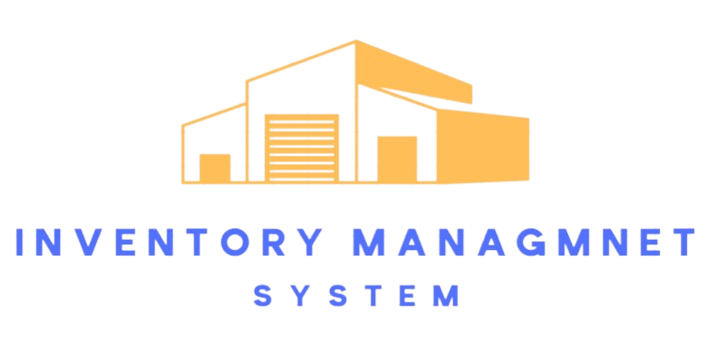

# inventory-management-system

<p align="center">
  
</p>

This is a simple inventory management system REST API, that allow managing Items, Customers, Orders, Suppliers, and supplies.
> [!NOTE]
> The API still under development and the documentation is not complete yet.


<p align="center">
    <a href="https://github.com/0xJ1NX">
        
    </a>
    <a href="https://app.swaggerhub.com/apis/1201062/Inventory-management-system/1.0.0#/">
        
    </a>
    
    
</p>
<br>
<p align="center">
    <a href="https://www.buymeacoffee.com/om4r">
        
    </a>
</p>

## 📝 Table of Contents
- [🧰 Resources](#-resources)
- [✏ ERD's and Diagrams](#-erds-and-diagrams)
- [📋 API Endpoints and Documentation](#-api-endpoints-and-documentation)
  - [/items](#items)
  - [/suppliers](#suppliers)
  - [/customers](#customers)
  - [/orders](#orders)
  - [/supplies](#supplies)
- [OpenAPI Documentation](#openapi-documentation)
- [📦 Installation](#-installation)


## 🧰 Resources
the following are the resources in the inventory management system API
- ***Items*** : the products in the inventory

- ***Suppliers*** : the people who supply the items to the inventory

- ***Customers*** : are the people who buy the items

- ***Orders*** : the transactions of the items between the customers and the inventory

- ***Supplies*** : the transaction of the items between the suppliers and the inventory

## ✏ ERD's and Diagrams
- The following diagram shows the Entity Relationship Diagram.
    

- The following diagram shows the database Design.
    

## 📋 API Endpoints and Documentation
- The following are the API endpoints and their documentation

`Base URL : example.com/api/v1`

### /items


### /suppliers


### /customers


### /orders


### /supplies


## OpenAPI Documentation

<p align="center">
    
</p>


- The OpenAPI v3.1.0 is available in the following link [SwaggerHub](https://app.swaggerhub.com/apis/1201062/Inventory-management-system/1.0.0#/)


## Postman Collection

<p align="center">
    
</p>

- The Postman collection is in the following file [Postman Collection](./postman/IMA.postman_collection.json)

## 📦 Running the project
- Clone the repository
    ```bash
    git clone https://github.com/0xJ1NX/inventory-management-system.git
    ```
- Change the directory to the project directory
    ```bash
    cd inventory-management-system
    ```
- Run the project
    ```bash
    gradle bootRun
    ```
- The project will run on the default port `8080`

